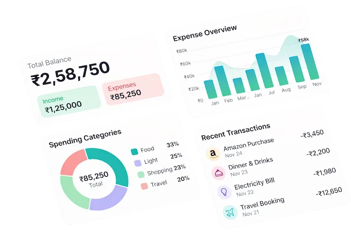
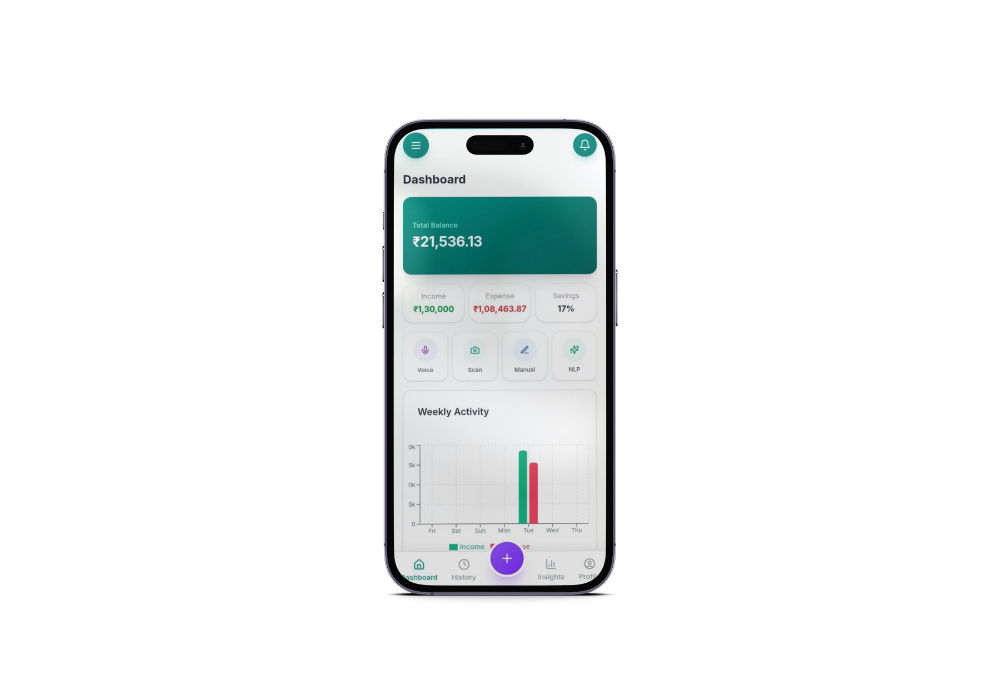
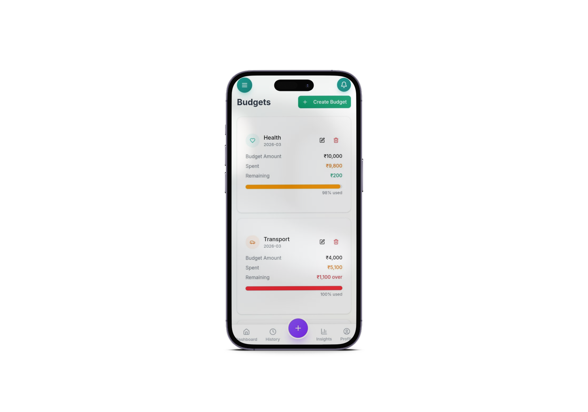
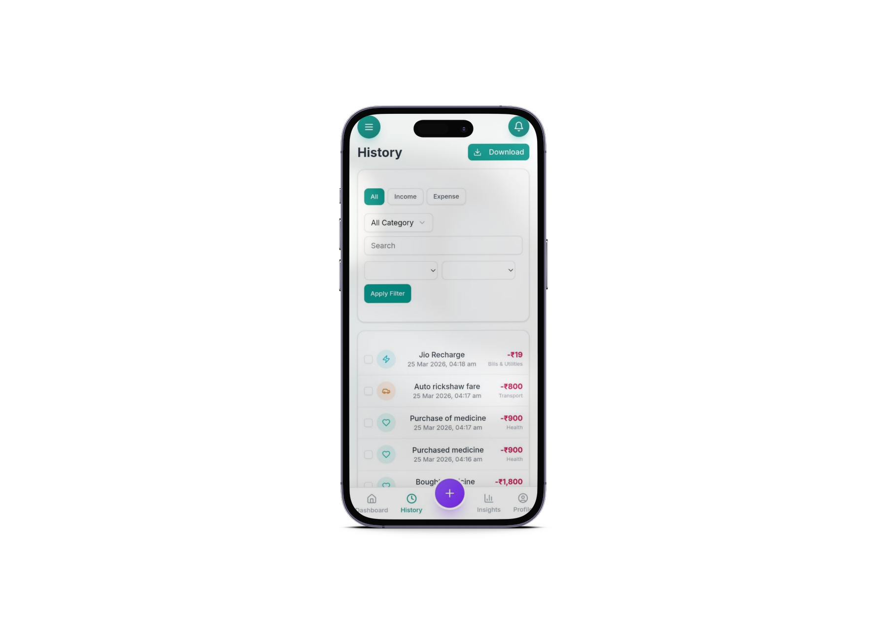
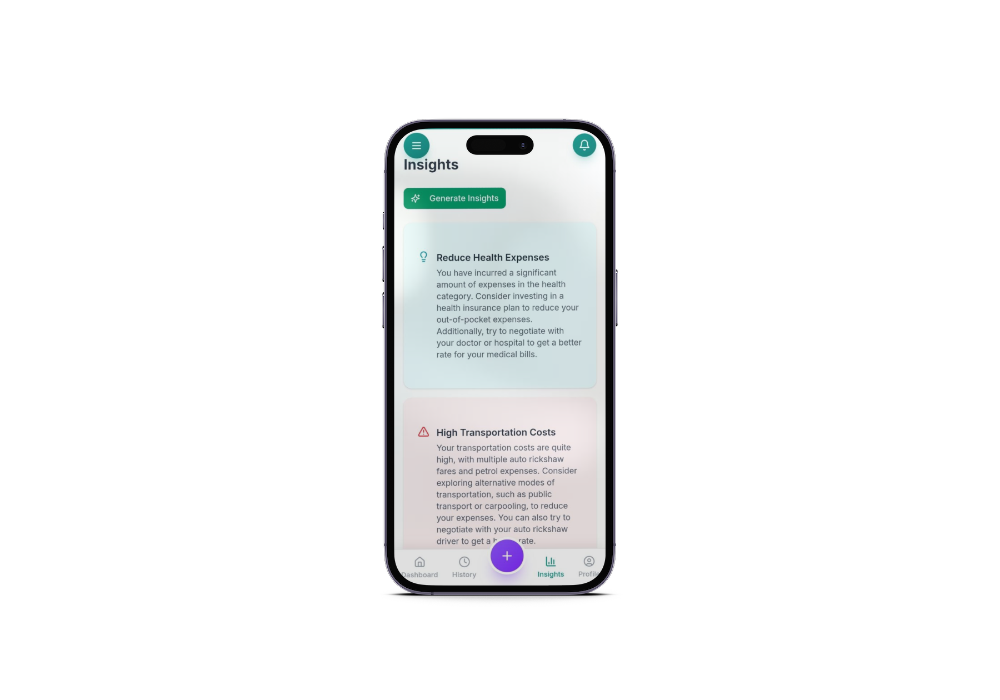
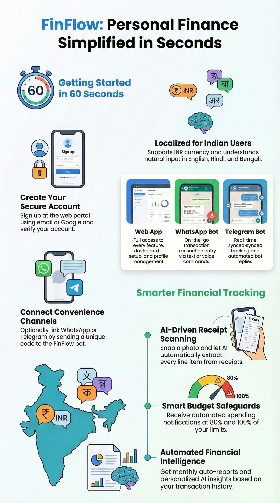

# FinFlow

<p align="center">
  
</p>

<p align="center">
  <strong>Personal Finance Management System</strong><br />
  Track, analyze, and manage your finances with AI-powered insights, voice input, receipt scanning, and natural language processing.
</p>

<p align="center">
  
  
  
  
  
  
</p>

---

<p align="center">
  
</p>

---

## Table of Contents

- [Overview](#overview)
- [Key Features](#key-features)
- [Tech Stack](#tech-stack)
- [Project Structure](#project-structure)
- [Getting Started](#getting-started)
  - [Prerequisites](#prerequisites)
  - [Installation](#installation)
  - [Environment Variables](#environment-variables)
- [Screenshots](#screenshots)
- [Architecture](#architecture)
- [Pages and Routes](#pages-and-routes)
- [Authentication](#authentication)
- [AI-Powered Transaction Entry](#ai-powered-transaction-entry)
- [Notifications](#notifications)
- [PWA Support](#pwa-support)
- [SEO and Analytics](#seo-and-analytics)
- [Admin Panel](#admin-panel)
- [Backup and Restore](#backup-and-restore)
- [Contributing](#contributing)
- [License](#license)

---

## Overview

FinFlow is a modern, full-stack personal finance management application built with Next.js. It enables users to effortlessly track expenses, manage budgets, generate reports, and gain actionable insights into their spending habits. The application supports multiple input methods -- natural language, voice, receipt scanning, and manual entry -- making transaction logging fast and intuitive.

The app is designed as a Progressive Web App (PWA), installable on any device, with offline-capable architecture and push notification support.

---

## Key Features

- **Multi-Mode Transaction Entry** -- Add transactions via Natural Language Processing (NLP), voice input, receipt/receipt photo scanning, or manual form entry.
- **Dashboard** -- Real-time overview of balances, spending trends, and recent transactions.
- **Budgets** -- Set category-wise budgets and track progress with visual indicators.
- **Insights** -- AI-driven analytics showing spending patterns, category breakdowns, and trends over time.
- **Reports** -- Generate detailed financial reports with export capabilities.
- **History** -- Full transaction history with search, filter, and sort functionality.
- **Authentication** -- Secure sign-up/login with email, Google OAuth, password reset, and Cloudflare Turnstile protection.
- **Notifications** -- In-app notification center with push notification support.
- **Backup and Restore** -- Export and import your financial data securely.
- **Profile and Privacy** -- User profile management with privacy and security settings.
- **Multi-Language Support** -- Language context for internationalization.
- **PWA Installable** -- Add to home screen on mobile or desktop for a native-like experience.
- **SEO Optimized** -- Sitemap, robots.txt, Open Graph images, and JSON-LD structured data.
- **Admin Panel** -- Administrative dashboard with notification management.
- **Analytics** -- PostHog integration for product analytics.

---

## Tech Stack

| Layer            | Technology                          |
| ---------------- | ----------------------------------- |
| Framework        | Next.js 15 (App Router)            |
| Language         | TypeScript                         |
| Styling          | Tailwind CSS                       |
| Authentication   | Supabase Auth                      |
| Database         | Supabase (PostgreSQL)              |
| Analytics        | PostHog                            |
| Bot Protection   | Cloudflare Turnstile               |
| Deployment       | Vercel                             |
| PWA              | Service Worker, Web Manifest       |
| State Management | React Context                      |
| UI Components    | Custom component library (Radix-based) |

---

## Project Structure

```
FinFlow/
├── app/                        # Next.js App Router pages
│   ├── (auth)/                 # Auth pages (login, signup, forgot/reset password)
│   ├── (landing)/              # Public landing pages (home, terms, privacy, support, guide)
│   ├── add/                    # Add transaction (NLP, Voice, Scan, Manual tabs)
│   ├── admin-dy26zyfv/        # Admin panel (protected)
│   ├── auth/callback/          # Auth callback route
│   ├── backup-restore/         # Backup and restore page
│   ├── budgets/                # Budget management
│   ├── dashboard/              # Main dashboard
│   ├── history/                # Transaction history
│   ├── insights/               # Analytics and insights
│   ├── notifications/          # Notification center
│   ├── privacy-security/       # Privacy and security settings
│   ├── profile/                # User profile
│   ├── reports/                # Financial reports
│   ├── settings/               # App settings
│   ├── transaction/[id]/       # Individual transaction detail
│   ├── globals.css             # Global styles
│   ├── layout.tsx              # Root layout
│   └── sitemap.ts              # Dynamic sitemap generation
├── components/                 # Reusable UI components
│   ├── auth/                   # Auth-related components
│   ├── landing/                # Landing page components
│   ├── layout/                 # Layout components
│   ├── notifications/          # Notification components
│   ├── skeletons/              # Loading skeleton components
│   └── ui/                     # Base UI primitives
├── context/                    # React Context providers
│   ├── LanguageContext.tsx      # i18n language provider
│   └── UserContext.tsx          # User state provider
├── lib/                        # Utility libraries and helpers
│   ├── supabase/               # Supabase client/server/middleware
│   ├── api-client.ts           # API client utilities
│   ├── categories.ts           # Category definitions
│   ├── db.ts                   # Database helpers
│   ├── notification-utils.ts   # Notification helpers
│   ├── push.ts                 # Push notification logic
│   ├── storage.ts              # Local storage helpers
│   ├── types.ts                # Shared TypeScript types
│   └── utils.ts                # General utilities
├── public/                     # Static assets
│   ├── icons/                  # PWA icons (all sizes)
│   ├── images/                 # Feature icons and images
│   ├── assets/                 # Loading animations
│   ├── sw.js                   # Service worker
│   └── site.webmanifest        # PWA manifest
├── types/                      # Global type definitions
├── middleware.ts               # Next.js middleware (auth protection)
├── next.config.ts              # Next.js configuration
├── vercel.json                 # Vercel deployment config
└── package.json                # Dependencies and scripts
```

---

## Getting Started

### Prerequisites

- Node.js 18+ installed
- npm or yarn package manager
- A Supabase project (for authentication and database)
- A PostHog project (for analytics, optional)
- A Cloudflare Turnstile site key (for bot protection)

### Installation

1. Clone the repository:

```bash
git clone https://github.com/your-username/finflow.git
cd finflow
```

2. Install dependencies:

```bash
npm install
```

3. Set up environment variables (see below).

4. Run the development server:

```bash
npm run dev
```

5. Open [http://localhost:3000](http://localhost:3000) in your browser.

### Environment Variables

Create a `.env.local` file in the project root with the following variables:

```env
# Supabase
NEXT_PUBLIC_SUPABASE_URL=your_supabase_url
NEXT_PUBLIC_SUPABASE_ANON_KEY=your_supabase_anon_key
SUPABASE_SERVICE_ROLE_KEY=your_supabase_service_role_key

# Cloudflare Turnstile
NEXT_PUBLIC_TURNSTILE_SITE_KEY=your_turnstile_site_key
TURNSTILE_SECRET_KEY=your_turnstile_secret_key

# PostHog (optional)
NEXT_PUBLIC_POSTHOG_KEY=your_posthog_key
NEXT_PUBLIC_POSTHOG_HOST=your_posthog_host

# Push Notifications (optional)
NEXT_PUBLIC_VAPID_PUBLIC_KEY=your_vapid_public_key
VAPID_PRIVATE_KEY=your_vapid_private_key
```

---

## Screenshots

### Dashboard

<p align="center">
  
</p>

### Budgets

<p align="center">
  
</p>

### History

<p align="center">
  
</p>

### Insights

<p align="center">
  
</p>

### Infographic

<p align="center">
  
</p>

---

## Architecture

FinFlow follows the **Next.js App Router** architecture with server components by default and client components where interactivity is needed.

```
Request Flow:
  Browser --> Middleware (auth check) --> Page (Server Component)
                                              |
                                              +--> Client Component (interactive)
                                              |
                                              +--> Supabase (data)
                                              |
                                              +--> API Client (external services)
```

- **Server Components** handle data fetching, SEO metadata, and static rendering.
- **Client Components** (files with `"use client"`) handle user interactions, forms, and real-time updates.
- **Middleware** protects routes and refreshes auth tokens.
- **Context Providers** (`UserContext`, `LanguageContext`) wrap the app for global state.
- **Skeleton Loaders** provide instant feedback during data loading.

---

## Pages and Routes

| Route                      | Description                                      | Access     |
| -------------------------- | ------------------------------------------------ | ---------- |
| `/`                        | Landing page with feature overview               | Public     |
| `/login`                   | Email/Google login                               | Public     |
| `/signup`                  | New account registration                         | Public     |
| `/forgot-password`         | Password reset request                           | Public     |
| `/reset-password`          | Password reset confirmation                      | Public     |
| `/dashboard`               | Main financial dashboard                         | Protected  |
| `/add`                     | Add transaction (NLP, Voice, Scan, Manual)       | Protected  |
| `/history`                 | Transaction history with filters                 | Protected  |
| `/budgets`                 | Budget creation and tracking                     | Protected  |
| `/insights`                | Spending analytics and trends                    | Protected  |
| `/reports`                 | Financial report generation                      | Protected  |
| `/transaction/[id]`        | Individual transaction detail view               | Protected  |
| `/notifications`           | In-app notification center                       | Protected  |
| `/profile`                 | User profile management                          | Protected  |
| `/settings`                | Application settings                             | Protected  |
| `/privacy-security`        | Privacy and security preferences                 | Protected  |
| `/backup-restore`          | Data export and import                           | Protected  |
| `/admin-dy26zyfv`          | Admin panel                                      | Admin Only |
| `/admin-dy26zyfv/notifications` | Admin notification management              | Admin Only |
| `/terms`                   | Terms of service                                 | Public     |
| `/privacy`                 | Privacy policy                                   | Public     |
| `/disclaimer`              | Legal disclaimer                                 | Public     |
| `/support`                 | Support and help center                          | Public     |
| `/user-guide`              | Getting started guide                            | Public     |

---

## Authentication

FinFlow uses **Supabase Authentication** with the following features:

- Email and password sign-up / login
- Google OAuth sign-in
- Forgot password / reset password flow
- Cloudflare Turnstile bot protection on auth forms
- Auth state listener (`AuthListener` component) for session management
- Middleware-based route protection with automatic token refresh
- Auth callback route for OAuth redirects

<p align="center">
  
</p>

---

## AI-Powered Transaction Entry

The `/add` page provides four methods for logging transactions:

| Tab       | Icon                                                        | Description                                                       |
| --------- | ----------------------------------------------------------- | ----------------------------------------------------------------- |
| NLP       |          | Type a sentence like "Spent $12 on coffee today" and let AI parse it. |
| Voice     |        | Speak your transaction and it will be transcribed and parsed.     |
| Scan      |      | Scan a receipt image to extract transaction details automatically.|
| Manual    | --                                                          | Fill in amount, category, date, and notes manually.              |

Each tab shares a live preview card showing the parsed transaction before confirmation.

---

## Notifications

FinFlow includes a full notification system:

- **Notification Bell** -- Appears in the app header with unread count badge.
- **Notification Center** -- Full-page view of all notifications with read/unread states.
- **Push Notifications** -- Browser push notifications via the Push API and VAPID keys.
- **Admin Notifications** -- Administrators can broadcast notifications to all users.

---

## PWA Support

FinFlow is a fully installable Progressive Web App:

- `public/site.webmanifest` -- App manifest with icons, theme color, and display mode.
- `public/sw.js` -- Service worker for caching and offline support.
- `public/icons/` -- Icons for all required sizes (72x72 through 512x512).
- `components/ui/InstallPrompt.tsx` -- Custom install prompt for supported browsers.

Users can install FinFlow directly from the browser on both mobile and desktop.

---

## SEO and Analytics

- **Sitemap** -- Dynamically generated via `app/sitemap.ts`.
- **Robots.txt** -- Configured in `public/robots.txt` with Bing site authentication.
- **Open Graph** -- OG image set via `public/og-image.png`.
- **JSON-LD** -- Structured data via `components/JsonLd.tsx` for rich search results.
- **PostHog** -- Product analytics integrated via `components/PostHogProvider.tsx`.
- **Update Notifications** -- `components/UpdateNotification.tsx` alerts users to new versions.

---

## Admin Panel

The admin panel is accessible at `/admin-dy26zyfv` (obfuscated route) and provides:

- Dashboard overview of platform metrics.
- Notification management -- create, schedule, and broadcast notifications to users.

Access is restricted to admin-level users only, enforced at the middleware and component level.

---

## Backup and Restore

The `/backup-restore` page allows users to:

- **Export** all transaction data as a downloadable file.
- **Import** previously exported data to restore financial records.

This ensures users maintain full ownership and portability of their financial data.

---

## Contributing

1. Fork the repository.
2. Create a feature branch: `git checkout -b feature/your-feature-name`
3. Commit your changes: `git commit -m "Add your feature"`
4. Push to the branch: `git push origin feature/your-feature-name`
5. Open a Pull Request.

Please ensure your code passes linting (`npm run lint`) and builds successfully (`npm run build`) before submitting.

---

## License

This project is proprietary software. All rights reserved.

---

<p align="center">
  
  <br />
  <strong>FinFlow</strong> -- Take control of your finances.
</p>
