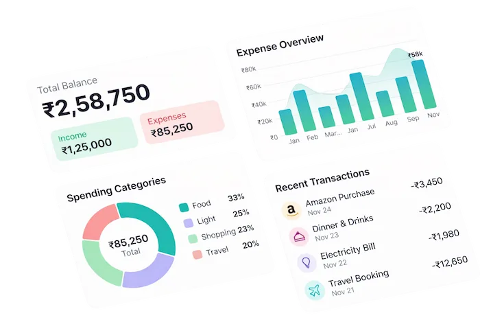

# FinFlow — Frontend

<p align="center">
  
</p>

<p align="center">
  <strong>Personal finance PWA for India</strong><br />
  Track expenses via text (NLP), voice, receipt scan, or manual entry — with budgets, AI insights, analytics, and monthly PDF reports.
</p>

<p align="center">
  
  
  
  
  
  
  
</p>

This is the **frontend** of FinFlow (Next.js 15 App Router). AI, email, push
delivery, and jobs run on a separate backend: [`finflow-api`](https://github.com/Sadab-Munshi/finflow-api).

<p align="center">
  
</p>

## Quickstart

```bash
npm install
cp .env.example .env.local   # fill values (names + purpose: docs/CONFIG.md)
npm run dev                  # → http://localhost:3000
```

The app needs the backend for AI/auth-adjacent endpoints — run finflow-api
locally (`NEXT_PUBLIC_API_URL=http://localhost:3001`) or point at the deployed API.

Production: `npm run build && npm start`. Deploy is Vercel (see `docs/DEPLOYMENT.md`).

> There are no automated tests; `npm run lint` and `npx tsc --noEmit` are the
> gates — builds ignore both (`next.config.ts:4-9`).

## Key features

- 4-mode transaction entry: **NLP text, voice, receipt scan, manual** (`/add`)
- Dashboard, budgets with 80/90/100% alerts, history with search/filter/PDF export
- AI insights + analytics suite (rolling averages, forecast, anomalies, YoY);
  AI usage governed by per-user daily/monthly + platform-wide admin limits
- Monthly PDF reports (generated by finflow-api), notifications, push
- Auth: email + Cloudflare Turnstile, Google/Microsoft OAuth, ban enforcement;
  reason-aware signup gating (open / invite-only / closed / domain allowlist)
- Platform control surfaces from Vertex: **maintenance lockout screen**,
  read-only + announcement banners, per-user evaluated **feature flags**
- en/hi/bn i18n · installable PWA with offline shell + push
- PostHog product analytics incl. instrumented events
  (`signup_completed`, `login`, `transaction_added`, `ai_used`) that power the
  admin funnels/cohorts ([docs/PLATFORM_CONTROLS.md](docs/PLATFORM_CONTROLS.md))

## Documentation

| | |
|---|---|
| **[docs/AGENTS.md](docs/AGENTS.md)** | Entry point for AI agents — commands, rules, boundaries |
| [docs/ARCHITECTURE.md](docs/ARCHITECTURE.md) | Request flow, route groups, feature map, invariants |
| [docs/ROUTES.md](docs/ROUTES.md) | Every path — auth, rendering, loading map |
| [docs/AUTH.md](docs/AUTH.md) | Middleware, 3 Supabase clients, OAuth, Turnstile, callback |
| [docs/STATE.md](docs/STATE.md) / [docs/CONVENTIONS.md](docs/CONVENTIONS.md) | Contexts & fetch map / style rules & forbidden list |
| [docs/CONFIG.md](docs/CONFIG.md) / [docs/SECRETS_MAP.md](docs/SECRETS_MAP.md) | Env vars / exposure & rotation |
| [docs/DEPLOYMENT.md](docs/DEPLOYMENT.md) / [docs/PWA.md](docs/PWA.md) / [docs/SEO.md](docs/SEO.md) | Ship it / install it / rank it |
| [docs/ANALYTICS.md](docs/ANALYTICS.md) / [docs/DESIGN_SYSTEM.md](docs/DESIGN_SYSTEM.md) / [docs/SCHEMA.md](docs/SCHEMA.md) | Telemetry + /analytics / Tailwind & ui/ / RLS tables |
| [docs/PLATFORM_CONTROLS.md](docs/PLATFORM_CONTROLS.md) | Maintenance gate, signup gating, feature flags, instrumented events |
| [docs/DEBT.md](docs/DEBT.md) / [docs/DECISIONS.md](docs/DECISIONS.md) / [docs/MIGRATION_NOTES.md](docs/MIGRATION_NOTES.md) | Known issues / ADRs / split history |
| [CONTRIBUTING.md](CONTRIBUTING.md) · [llms.txt](llms.txt) · [skills/](skills/) | PR rules · agent discovery · task checklists |

Legacy agent context: [CLAUDE.md](CLAUDE.md) — where it conflicts with `docs/`,
**docs/ and the code win**.

## License

This project is proprietary software. All rights reserved.

---

<p align="center"><strong>FinFlow</strong> — take control of your finances.</p>
